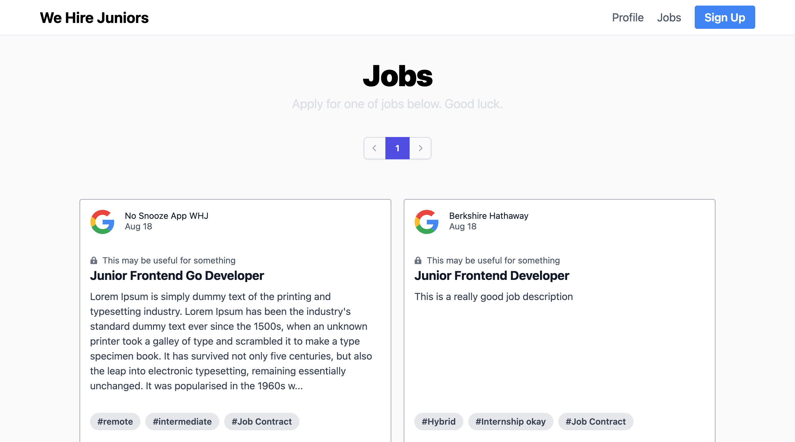
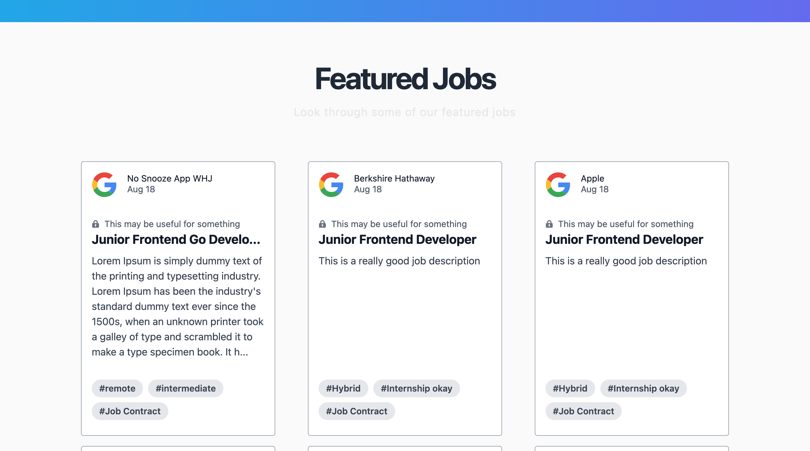

# We Hire Juniors

[Link](https://whjreal-backend.onrender.com)

> A Web App that allows Junior Proffesionals to enter the job market.

- Hero section

- Jobs page

- Simple Ad section :)

- Jobs posted latest will appear in this section.

## Current Features

- An organisation can post a job which will be saved to the MongoDB database.
- A organisation or user can create an account using their Gmail account and Oauth2 which will be saved to the MongoDB database.
- Users can view and apply for the different jobs posted by the organisations.

## Built With

- Tailwind CSS
- React
- NodeJS
- Mongo DB

## Authors

👤 **Emmanuel Obonyo**

- GitHub: [@emmyobonyo](https://github.com/emmyobonyo)
- Twitter: [@emmyobonyo](https://twitter.com/emmyobonyo)
- LinkedIn: [Emmanuel Obonyo](https://www.linkedin.com/in/emmyobonyo/)

## Show your support

Give a ⭐️ if you like this project!
